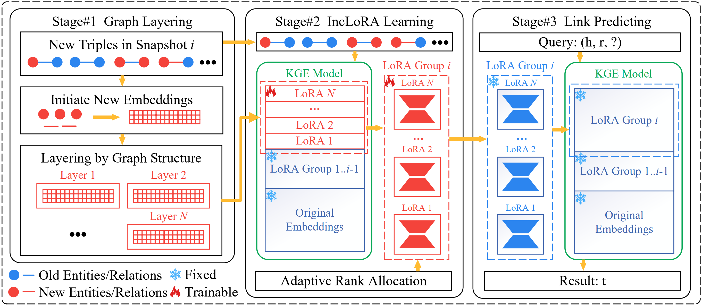

# FastKGE

The codes and datasets for "Fast and Continual Knowledge Graph Embedding via Incremental LoRA". [IJCAI 2024]

## Framework



## Folder Structure

The structure of the folder is shown below:

```csharp
 FastKGE
 ├─checkpoint
 ├─data
 ├─logs
 ├─save
 ├─src
 ├─requirements.txt
 ├─data_to_id.py
 ├─cal_features.py
 ├─nodes_sort.py
 ├─main.py
 └README.md
```

Introduction to the structure of the folder:

- /checkpoint: The generated models are stored in this folder.
- /data: The datasets are stored in this folder.
- /logs: Logs for the training are stored in this folder.
- /save: Optional Results generated by models.
- /src: Source codes are of the method.
- requirements.txt: Required libraries.
- data_to_id.py, cal_features.py, and nodes_sort.py: To prepare the data processing.
- main.py: To run the FastKGE.
- README.md: Instruct on how to realize FastKGE.

## Requirements

All experiments are implemented on the NVIDIA RTX 3090Ti GPU with the PyTorch. The version of Python is 3.7.

Please run as follows to install all the dependencies:

```shell
pip3 install -r requirements.txt
```

## Usage

### Preparation

1. Prepare the data processing in the shell:

```shell
python data_to_id.py
python cal_features.py
python nodes_sort.py
```

### Run the code

2. Run the code with this in the shell:

```shell
./main.sh
```

## Citation

If you find this method or code useful, please cite

```latex
@inproceedings{liu2024fast,
  title={Fast and Continual Knowledge Graph Embedding via Incremental LoRA},
  author={Jiajun Liu, Wenjun Ke, Peng Wang, Jiahao Wang, Jinhua Gao, Ziyu Shang, Guozheng Li, Zijie Xu, Ke Ji and Yining Li},
  booktitle={IJCAI},
  year={2024}
}
```

